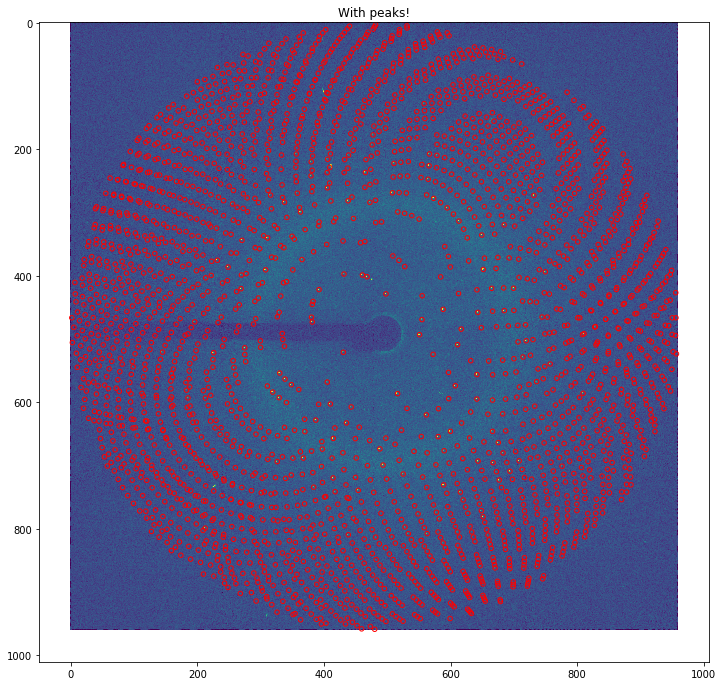
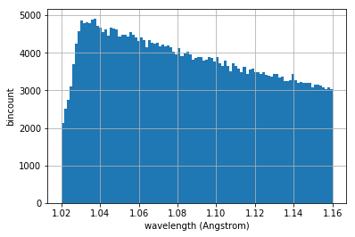
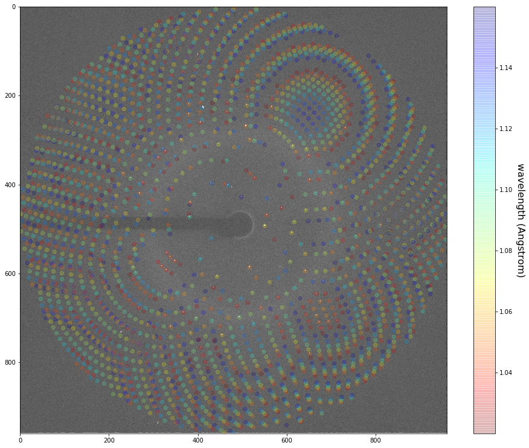
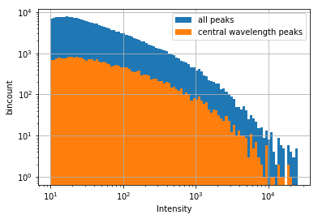

## Laue net


### Table of Contents
0. [Gather data from precognition logs](#gather)
1. [Verify data in the logs](#verify)
2. [Running indexmajig](#indexa)

<a name="gather"></a>
##Gather data from precognition logs
```python
%matplotlib inline
# this notebook is the start of a neural network routine
# that uses Bragg spot locations and intensity and wavelength spectrum analysis
# to assign a Bragg spots wavelength

# we begin with data taken from precognition on
# a well diffracting protein crystal 

# this is based on the serial-millisecond methof of crystallograhy
# hence each frame represents a snapshot
import sys,os
import glob,re
import numpy as np
import pandas

```


```python
# We start with the precognition log files 
# after it was used to successfully index and integrate
# several patterns

# the goal here is to get the relevant information from the logs into
# e.g. (orientation matrix, filename) tuples

log_hits = open("process_all.log", "r").read()
log_matrix = open("apply_all_3sig.log","r").read()

```


```python
hit_names = re.findall("run[0-9]{4}_[0-9]{5}.mccd", log_hits)
```


```python
index_info = re.findall("@run[0-9]{4}_[0-9]{5}\.mccd.*?(?=Script file is closed.)", log_matrix, re.DOTALL)
```


```python
# not all hits are indexed by precognition
print("Indexed %d out of %d hits" %(len(index_info), len(hit_names)))
```

    Indexed 757 out of 825 hits


```python
# we are interested in the missetting matrix data
# From preconition manual version 5.0 section 11.1.1.6
"""
Missetting matrix defines the rotation from an aligned crystal orientation to any other orientation. 
The aligned crystal orientation is defined as the following: a-b plane is normal to X-ray beam,
that is, a × b or c* is along X-ray beam or Z-axis. a is horizontal to the
right when looking along the X-ray beam, that is, X-axis.

Matrix r11 r12 r13 r21 r22 r23 r31 r32 r33

 = [ r11 r12 r12
     r21 r22 r23
     r31 r32 r33]
     
"""
print index_info[0] # note, I used these parameters to make a geom file and a cell file for crystfel
```

    @run0001_00149.mccd.inp
    Script file "run0001_00149.mccd.inp" is opened for input.
    Input
       Crystal    68.300 68.300 108.340 90.000 90.000 90.000 96
    Loading the Space-group Database ... The space-group #96 is loaded.
    File /usr/local/rri/cpl/ccl/lib/symlib read.
       Matrix     0.419126 -0.690406 -0.589638 0.479264 0.719818 -0.502163 0.771128 -0.072123 0.632582
       Omega      -90.000 0.000
       Goniometer 0.000 0.000 0.000
    
       Format     RayonixMX340
       Distance   299.949 0.020
       Center     1988.55 1966.88 0.20 0.20
       Pixel      0.088598 0.088600 0.000010 0.000000
       Swing      0.000 0.000 0.000 0.000
       Tilt       -0.016709 -0.231958 0.100000 0.100000
       Bulge      0.000000000000 0.000000000000 0.000000000000 0.000000000000
    
       Image 0    run0001_00149.mccd
       Resolution 2.20 100.00
       Wavelength 1.02 1.16
       Quit
    
    


```python
matrices = []
names = []
for info in index_info:
    lines = info.split("\n")
    matrix_info =  map( float, lines[6].split()[1:] )
    name = lines[0].split("@")[1].split(".inp")[0]
    matrices.append( matrix_info)
    names.append( name)
    
```


```python
data ={'matrix':matrices,'name':names}
df = pandas.DataFrame( data) 
df.to_pickle("matrix.pkl")
```


```python
# we only have integrated intensity values currently for the hits from run 1
ii_names = glob.glob( "integrated_intens/*.ii")
```


```python
# not all of the hits with integrated intensity values had orientation matrices in the logs:
ii_names_in_log = [ name for name in ii_names if os.path.basename(name).split(".ii")[0] in df.name.values]
print("%d / %d integrated intensity files had orientation matrix data in the logs"
          %(len(ii_names_in_log), len(ii_names)))
```

    147 / 173 integrated intensity files had orientation matrix data in the logs


```python
# lets load the integrated intensity data in a long-format dataframe

# content of the .ii files is found in the precognution manual v 5.0, section 11.5.6

# note I had to determine which peak coor was pix_fs, pix_ss through trial and error!

all_ii_dfs = []
ii_cols = ['h','k','l','multiplicity','pix_fs','pix_ss','res','wavelength','Intensity','sigma(I)']
for i_name, name in enumerate(ii_names_in_log):
    ii_data = np.loadtxt(name)
    ii_df = pandas.DataFrame(columns=ii_cols, data=ii_data)
    ii_df['name'] = os.path.basename(name).split('.ii')[0]
    all_ii_dfs.append( ii_df)
    print "\rLoading dataframe %d / %d"%(i_name+1, len( ii_names_in_log)),
    sys.stdout.flush()
```

    Loading dataframe 147 / 147                                                                                                                                                


```python
# store as a dataframe
df_ii = pandas.concat(all_ii_dfs)
df_ii.to_pickle("integrated_intensity.pkl")
```


```python
# now we have to download the files from saguaro!

```

<a name="verify"></a>
### Verify data in the logs
```python
%matplotlib inline

import os
import pandas
from IPython.display import clear_output
import h5py
import numpy as np
import pylab as plt
df = pandas.read_pickle("matrix.pkl")
df_ii = pandas.read_pickle("integrated_intensity.pkl")

```


```python
fnames = df_ii.name.unique()
gb = df_ii.groupby("name")
```


```python
# this hdf5 has the image data but binned by a factor of 4!
h5 = h5py.File("these_images_binned4x.h5", "r+")

# therefore we should update the df_ii dataframe to include peak positions binned by same factor
df_ii['pix_fs_4'] = df_ii.pix_fs/4.
df_ii['pix_ss_4'] = df_ii.pix_ss/4.
```


```python
def get_img( fname):
    idx = list(h5['names'].value).index(fname)
   
    img = h5['data'][idx]
    return img
```


```python
f0 = df_ii.name.unique()[0]
ii_0 = gb.get_group( f0) 
img_0 = get_img( f0)
```


```python
plt.figure(1, figsize=(12,12))
plt.imshow( img_0, vmin=100, vmax=300)
```


    <matplotlib.image.AxesImage at 0x11b71a610>


```python
# it would be instructive to verify the peaks in our database match up to this image
y,x = ii_0.pix_ss_4, ii_0.pix_fs_4
plt.figure(1, figsize=(12,12))
plt.title("With peaks!")
plt.imshow( img_0, vmin=120, vmax=300)
plt.scatter( x, y, s=20, facecolor='none', edgecolor='r')

```


    <matplotlib.collections.PathCollection at 0x11c1997d0>





```python
# Precognition assigns a wavelength to each found Bragg peak..
# ... so lets see what the wavelength distribution from this processed data looks like

df_ii.wavelength.hist(bins=100)
plt.xlabel("wavelength (Angstrom)")
plt.ylabel("bincount")
```


    Text(0,0.5,'bincount')





```python
# It would be interesting to view on our image what the wavelength distribution looks like
plt.figure(1, figsize=(10,8))
plt.scatter( x,y, c=ii_0.wavelength, cmap='jet_r', s=20)
plt.colorbar().ax.set_ylabel("wavelength (Angstrom)", rotation=270, labelpad=20, fontsize=16)
```


    Text(0,0.5,'wavelength (Angstrom)')


```python
# the goal of this analysis is to build a model network that
# can auto-label Bragg peaks in an image like above , given a wavelength spectrum and 
# a found peaks list 
# and perhaps other data, e.g. crystal symmetry information, pixels size.. etc

# once the peaks are labeled according to wavelength, then mosflm can be used to index the image
# (e.g. by picking the largest set of peaks corresponding to a single wavelength)

# The challenge will be to featurize all the above information into an appropriate training set
```


```python
# Lets try to plot the above with the intensity information as well
plt.figure(1, figsize=(16,13))
plt.imshow( img_0, vmin=50, vmax=350, cmap='gray')
plt.scatter( x,y, c=ii_0.wavelength, cmap='jet_r', s=40, alpha=0.2) 
plt.colorbar().ax.set_ylabel("wavelength (Angstrom)", rotation=270, labelpad=20, fontsize=16)
plt.ylim(960,0)
plt.xlim(0,960)
```


    (0, 960)





```python
# Actually, based on the above plot, it seems the visible peaks mostly arise
# due to the maximum wavelength in the spectrum

# we can maybe use this information to simplify our model...

```


```python
# Before going hard in the paint and setting up this model, 
# lets first verify the main hypothesis
"""
If we use just isolate central-wavelength Bragg reflections on an image,
then we can use mosflm and "just those peaks" to index the pattern
"""
# To do test this, we can determine precisely which peaks are central-wavelength peaks

# From the wavelength spectrum above it seems central wavelength is a little greater than 1.03 Angstrom

# Therefore, we will say 1.0275 Angstrom < wavelength < 1.04 Angstrom 
# corresponds to the central wavelength
bins = np.linspace( 1.02, 1.16, 100)
df_ii.wavelength.hist(bins=bins)
df_ii_central = df_ii.query(" %.4f < wavelength < %.4f"%(1.0275, 1.04))
df_ii_central.wavelength.hist(bins=bins)
plt.legend(["all peaks", "central wavelength peaks"])
plt.ylabel("bincount")
plt.xlabel("wavelength (Angstrom)")
```


    Text(0.5,0,'wavelength (Angstrom)')


```python
# lets pick out just those central wavelength peaks
# and store them in a CXIDB peaks format
# so that we can try to index the patterns using them


# lets make a function to help us out:
def get_peak_from_ii_dataframe(df, h5=h5):
    """
    gets peaks positions and intensities (in form of three lists)
    from the integrated intensity dataframes
    
    df is a pandas Integrated intensity dataframe
    h5 is the CXIDB file handle which contains the images described in by df
    
    NOTE: names path in the h5 should correspond to the name column in the df
    """
    gb = df.groupby("name")
    
    all_y, all_x, all_I = [],[],[]
    name_in_h5_order = h5['names'].value
    for name in name_in_h5_order:

        #get the peaks only labeled by central wavelength
        df_name = gb.get_group(name)
        y,x = df_name.pix_ss_4 , df_name.pix_fs_4
        I = df_name.Intensity
        all_y.append(y)
        all_x.append(x)
        all_I.append( df_name.Intensity)

    return all_x, all_y, all_I


    
```


```python
all_x, all_y, all_I = get_peak_from_ii_dataframe( df_ii)
central_x, central_y, central_I = get_peak_from_ii_dataframe(df_ii_central)
```


```python
# here is a function for updating an already opened h5 file with CXIDB peaks!
def write_cxi_peaks( h5, peaks_path, pkX, pkY, pkI):
    if peaks_path in h5.keys():
        print("Peaks path '%s' is already taken!"%peaks_path)
        return
    npeaks = np.array( [len(x) for x in pkX] )
    max_n = max(npeaks)
    Nimg = len( pkX )
    
    data_x = np.zeros((Nimg, max_n), dtype=np.float32)
    data_y = np.zeros_like(data_x)
    data_I = np.zeros_like(data_x)

    for i in xrange( Nimg): 
        n = npeaks[i]
        data_x[i,:n] = pkX[i]
        data_y[i,:n] = pkY[i]
        data_I[i,:n] = pkI[i]
    
    peaks = h5.create_group(peaks_path)
    peaks.create_dataset( 'nPeaks' , data=npeaks)
    peaks.create_dataset( 'peakXPosRaw', data=data_x )
    peaks.create_dataset( 'peakYPosRaw', data=data_y )
    peaks.create_dataset( 'peakTotalIntensity', data=data_I ) 


```


```python
write_cxi_peaks(h5, "all_peaks", all_x, all_y, all_I)
write_cxi_peaks(h5, "only_central_peaks", central_x, central_y, central_I)
```

    Peaks path 'all_peaks' is already taken!
    Peaks path 'only_central_peaks' is already taken!


```python
# we can verify these peaks were added to the CXIDB file 
# by using the light-weight ddview (or else your own viewer!)
```


```python
# lets also look at the intensity of central wavelength peaks vs all the peaks
bins = np.logspace(1,4.4,100)
df_ii.Intensity.hist(bins=bins, log=True)
df_ii_central.Intensity.hist(bins=bins, log=True)
plt.gca().set_xscale("log")
plt.ylabel("bincount")
plt.xlabel("Intensity")
plt.legend(["all peaks", "central wavelength peaks"])
```


    <matplotlib.legend.Legend at 0x122012910>





```python
# lets also save just the brightest peaks
df_bright = df_ii.query("Intensity > 200")
bright_x, bright_y, bright_I = get_peak_from_ii_dataframe( df_bright)
write_cxi_peaks(h5, "bright_peaks", bright_x, bright_y, bright_I)

df_brightest = df_ii.query("Intensity > 400")
bright_x, bright_y, bright_I = get_peak_from_ii_dataframe( df_brightest)
write_cxi_peaks(h5, "brightest_peaks", bright_x, bright_y, bright_I)


```


```python
# in any case, we will run indexamajig and see how 
# mosflm behaves when using the central wavelength peaks vs all the peaks vs the brightest peaks!
```


```python

h5.close()
```

<a name="indexa"></a>
##Running indexamajig
Here we discuss running indexamajig on these data. We populated the CXIDB file with several peak lists. In particular. Using all of the peaks to index failed completely (0% indexing rate). Using the bright peaks had decent success (82.3 % indexing rate) and as expected, using the central wavelengths had a near-perfect indexing rate (99.3 %), in support of the hypothesis. 

We ran the following three indexamajig commands (using version 7.0)

```
indexamajig  -i 4x.txt  -o 4x_using_brightpeaks.stream -g 4x.geom  --hdf5-peaks=/bright_peaks --peaks=cxi --indexing=mosflm -j 3

indexamajig  -i 4x.txt  -o 4x.stream -g 4x.geom  --hdf5-peaks=/only_central_peaks --peaks=cxi --indexing=mosflm -j 3

indexamajig  -i 4x.txt  -o 4x_using_allpeaks.stream -g 4x.geom  --hdf5-peaks=/all_peaks --peaks=cxi --indexing=mosflm -j 3
```

which produced 3 stream files. (links to stream files coming soon)


